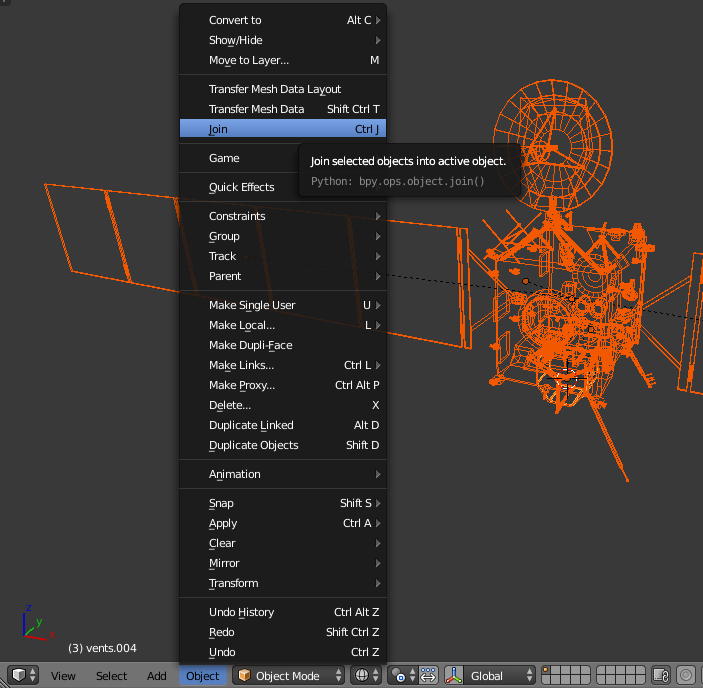
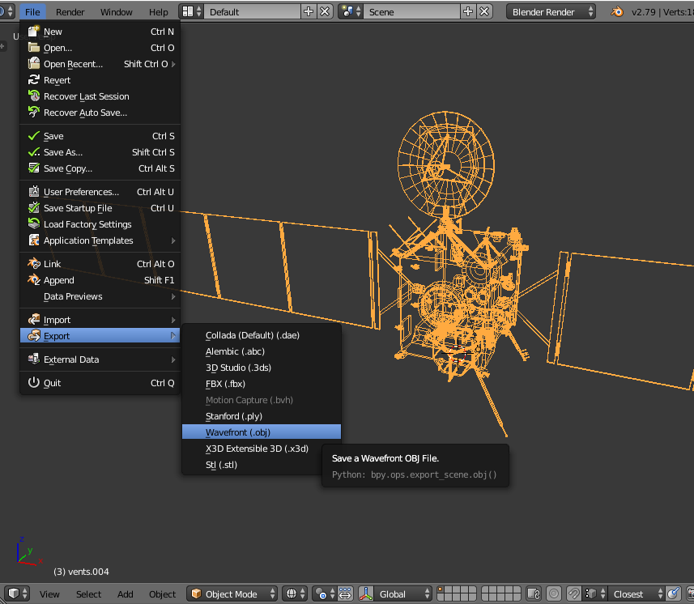
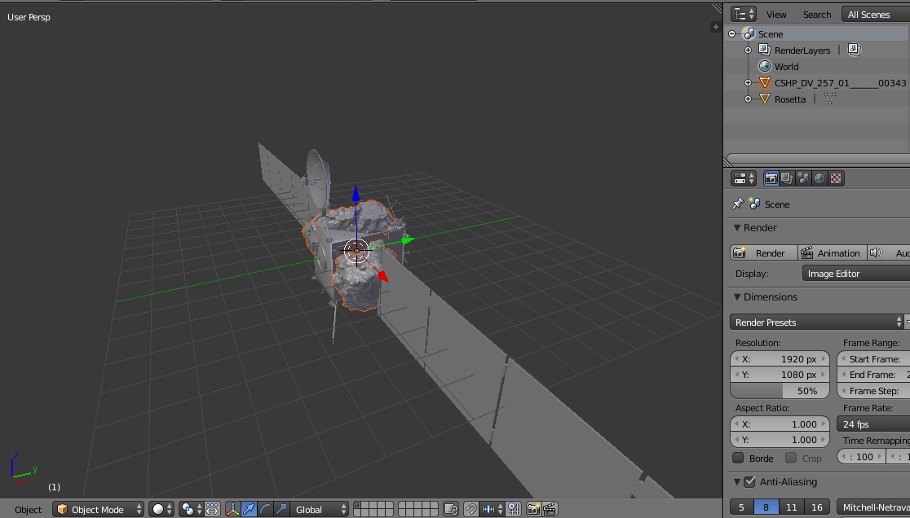
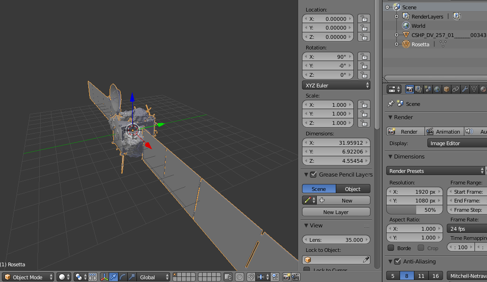
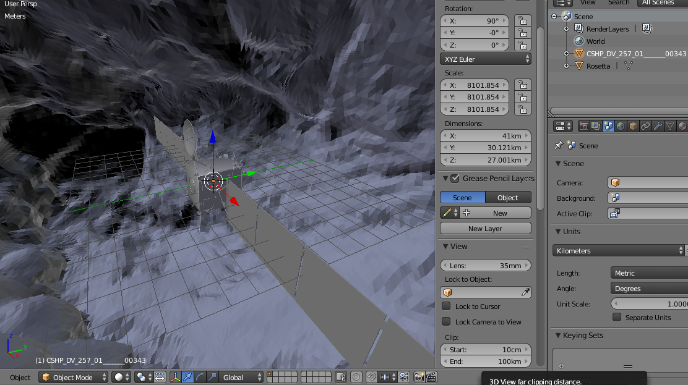
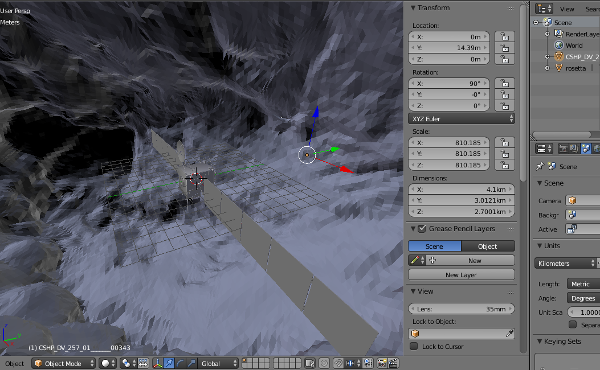
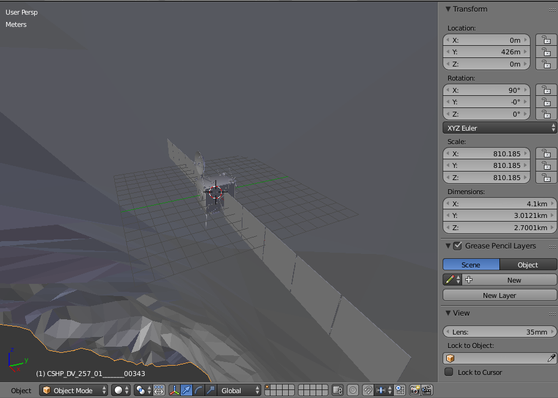
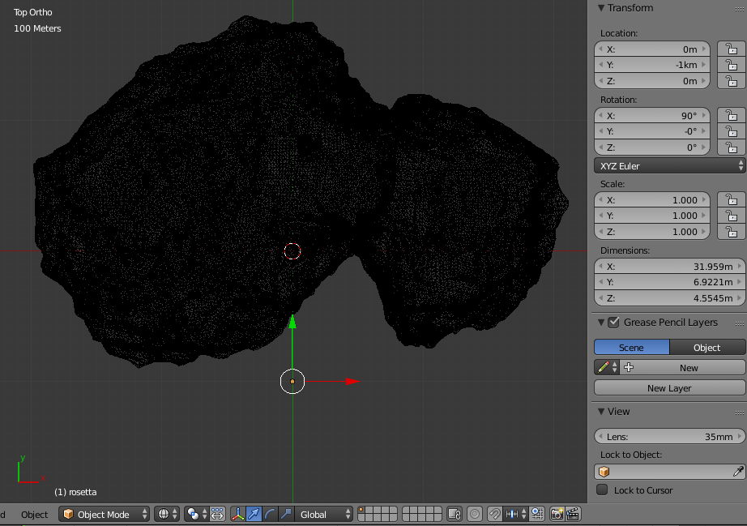
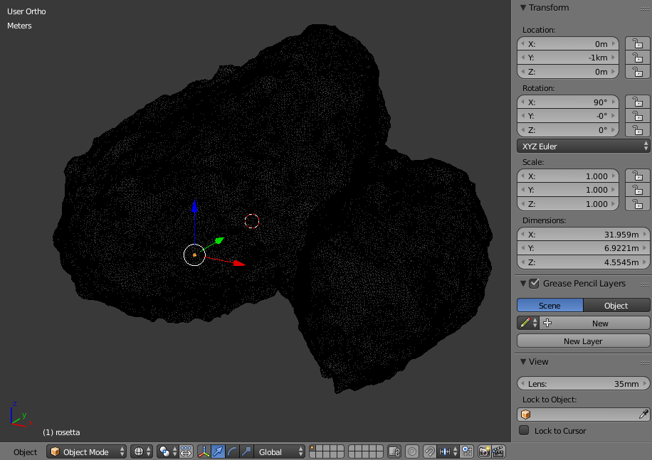

# ARKit-Stereoscope-67P

ARKit stereoscope visualizes the relative sizes of ESA Rosetta space probe to 67P/Churyumov-Gerasimenko comet.

This project was inspired by a European Space Agency's webpage explaining the relative sizes of the Rosetta space probe to comet 67P/Churyumov-Gerasimenko:
 
[ESA: How big is Rosetta compared with the comet?](http://sci.esa.int/rosetta/54831-how-big-is-rosetta-compared-with-the-comet/)

Question: What would it be like to see the relative sizes of Rosetta and 67P in virtual reality?
 
With ESA and NASA open sourcing their data such as 3D models and images, anyone can use tools such as iPad Swift Playgrounds and ARKit to visualize the data with a stereoscope.

# Hardware

1. Apple 9.7" iPad (tested on 2018 model, A9 CPU or higher for ARKit, should work on 2017 9.7" iPad).

2. The OWL Stereoscopic Viewer(£15.00) from [The London Stereoscopic Company Ltd](https://www.londonstereo.com/)

   Beside using it to view 3D models with tracking, it can also be used in a browser to view stereoscopic images from [Library of Congress](http://www.loc.gov/pictures/collection/stereo/) or [New York Public Library](https://stereo.nypl.org/).

   For more current images, try [London Stereoscopic Company Ltd](https://www.londonstereo.com/3-D-gallery1.html).
   
   

It is advisable to get a protective silicon case for the iPad to minimize the stereoscope sliding on the screen. The stereoscopic viewer is held in place by the user to allow switching between viewing and programming Swift. "Portrait Orientation Lock" is on as this should be the most comfortable position to hold the iPad with the viewer and moving around virtual objects.

# Software

Apple Swift Playgrounds (2.2) from iOS App Store. Swift Playgrounds lets kids program their iPad directly to experiment with ARKit and Scenekit.

[Swift Playgrounds](https://www.apple.com/ca/swift/playgrounds/)

# Installation

In iOS Safari, [download ARKit-Stereoscope-67P.playground.zip](https://github.com/Physicslibrary/ARKit-Stereoscope-67P/blob/master/ARKit-Stereoscope-67P.playground.zip), and "Open in Playgrounds".

ARKit-Stereoscope-67P playground was created from the Blank template in Swift Playgrounds.

# Credits
 
ESA_Gaia_DR2_AllSky_Brightness_Colour_Cartesian_2000x1000.png 
Date: 25 April 2018 
Satellite: Gaia 
Copyright: ESA/Gaia/DPAC, CC BY-SA 3.0 IGO 
http://sci.esa.int/gaia/60196-gaia-s-sky-in-colour-equirectangular-projection/ 
 
CSHP_DV_257_01_______00343.obj (OBJ File 3.8MB) 
Copyright: ESA/Rosetta/NAVCAM – CC BY-SA IGO 3.0 
https://imagearchives.esac.esa.int/index.php?/page/navcam_3d_models 

Rosetta.blend (Rosetta.zip 4MB) 
Author/Origin: Eyes on the Solar System. NASA/JPL-Caltech 
https://nasa3d.arc.nasa.gov/detail/eoss-rosetta 

# Using Blender to scale Rosetta and 67P comet

In the [playground Resources folder](https://github.com/Physicslibrary/ARKit-Stereoscope-67P/blob/master/ARKit-Stereoscope-67P.playground/Pages/Rosetta%20vs%2067P.xcplaygroundpage/Resources/), there are 5 files: 

67P.obj 
67P.png 
ESA_Gaia_DR2_AllSky_Brightness_Colour_Cartesian_2000x1000.png 
cube.obj 
rosetta.obj 

Blender 2.79b scales Rosetta.blend to 32m and exports as rosetta.obj.

CSHP_DV_257_01_______00343.obj is scaled to 41km and exported as 67P.obj, and Cycles render baked to texture 67P.png 
 
https://www.blender.org/ 

This section assumes users are familiar with Blender (www.blender.org, YouTube, books) and shows some steps used in project.

Open Rosetta.blend from [NASA 3D Resources](https://nasa3d.arc.nasa.gov/detail/eoss-rosetta). Display wireframe, press key "a" , and join all meshes.

Export from Blender with option "Selection Only" (turn off others).

Restart Blender, import Rosetta.obj and CSHP_DV_257_01_______00343.obj. 

Select Rosetta. X in "Dimensions" is a correct 32m but 67P is similar in size.

On the right, "Units" to Kilometers and "Length: Metric". 
Select 67P object, change X in "Dimensions" to 4.1km. "Scale: X:" adjusts itself to 810.185. Change Y and Z to 810.185. 
Change "View Clip:" to 10km to see the whole comet. 

Rosetta is inside the comet. With the comet still selected, increase its Y location with positive value. 

Rosetta reaches the surface when the comet is shifted 426m.

Change view to "Top" and "Ortho". Select Rosetta and move its Y location -1km.

