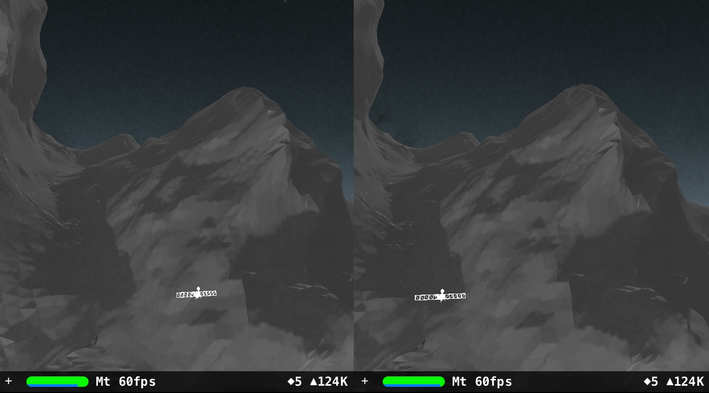
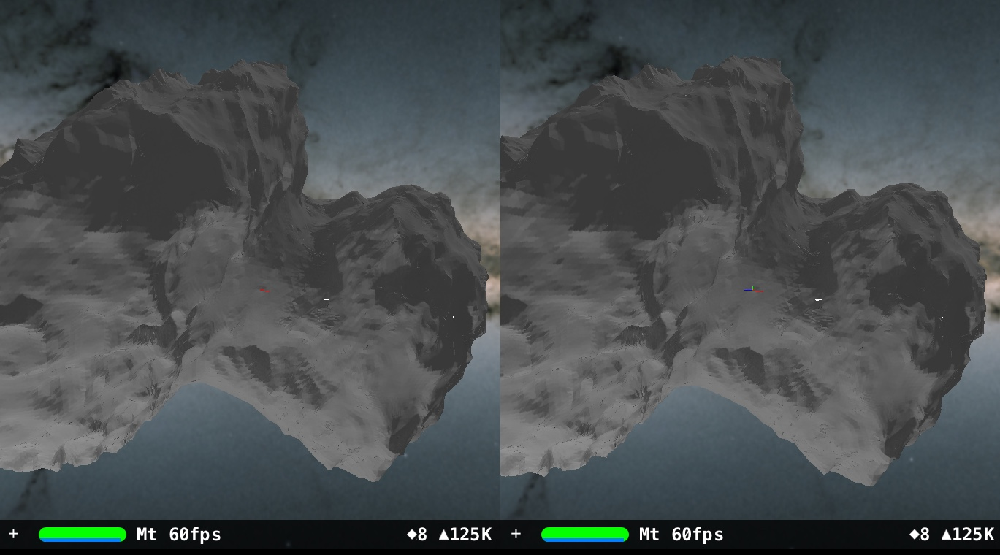
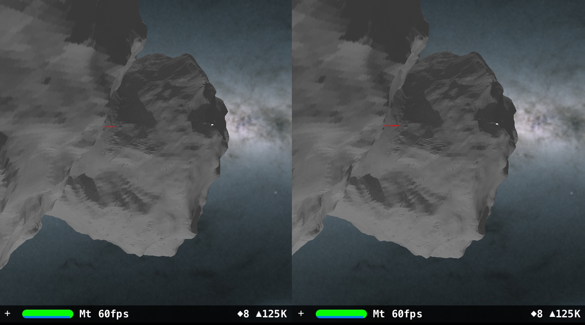
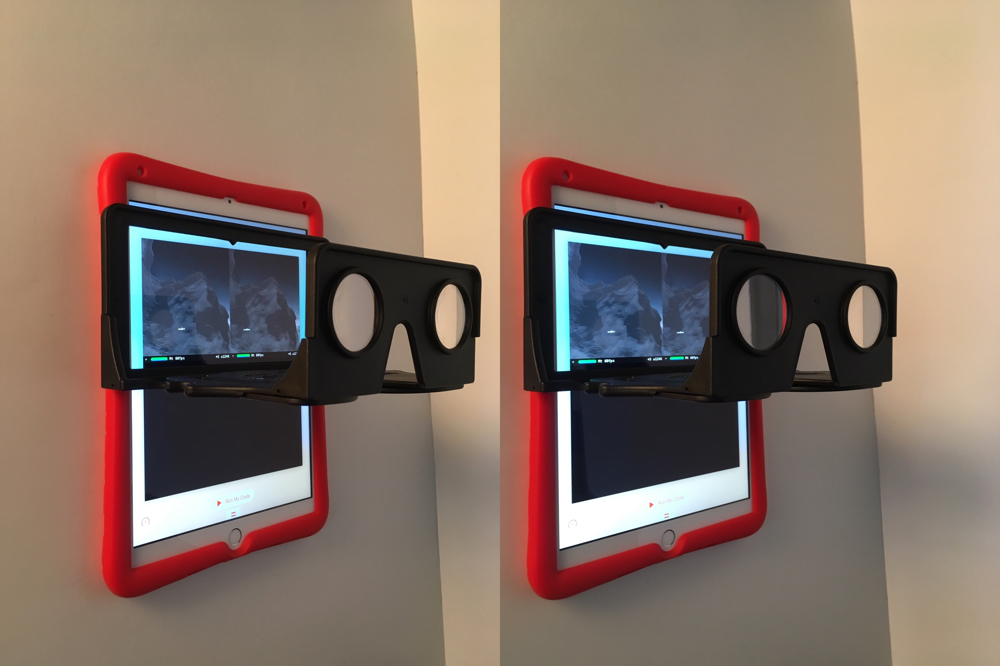

# ARKit-Stereoscope-67P

ARKit stereoscope visualizes the relative sizes of ESA Rosetta space probe to 67P/Churyumov-Gerasimenko comet.

This project was inspired by a European Space Agency's webpage explaining the relative sizes of the Rosetta space probe to comet 67P/Churyumov-Gerasimenko:
 
[ESA: How big is Rosetta compared with the comet?](http://sci.esa.int/rosetta/54831-how-big-is-rosetta-compared-with-the-comet/)

Question: What would it be like if one could see the relative sizes of Rosetta and 67P in virtual reality?
 
Since ESA and NASA have an educational policy of open sourcing their data such as 3D models and images, one can use tools such as Apple iPad Swift Playgrounds and ARKit to visualize the data with a stereoscope.

# Hardware

1. Apple 9.7" iPad (tested on 2018 model, A9 CPU or higher for ARKit, should work on 2017 9.7" iPad model).

2. The OWL Stereoscopic Viewer(£15.00) from [The London Stereoscopic Company Ltd](https://www.londonstereo.com/)

   Beside using it to view 3D models with tracking, it can also be used, in a browser (no ARKit needed), to view stereoscopic images from [Library of Congress](http://www.loc.gov/pictures/collection/stereo/) or [New York Public Library](https://stereo.nypl.org/).

   For more current images, try [London Stereoscopic Company Ltd](https://www.londonstereo.com/3-D-gallery1.html).
   
   

It is advisable to get a protective silicon case for the iPad to minimize the stereoscope sliding on the screen. The stereoscopic viewer is held in place by the user to allow switching between viewing and programming Swift. "Portrait Orientation Lock" is on as this should be the most comfortable position to hold the iPad with the viewer and moving around virtual objects.

# Software

Apple Swift Playgrounds (2.2) from iOS App Store. Swift Playgrounds lets kids program their iPad directly to experiment with ARKit and Scenekit.

# Installation (coming)

In iOS Safari, click the following [link](https://github.com/Physicslibrary/ARKit-Stereoscope-67P/blob/master/dist/ARKit-Stereoscope-67P.playground.zip), press "Download", and "Open in Playgrounds".

ARKit-Stereoscope-67P playground was created from the Blank template in iOS Swift Playgrounds.

# References

# How to use Blender to scale Rosetta and 67P comet.

