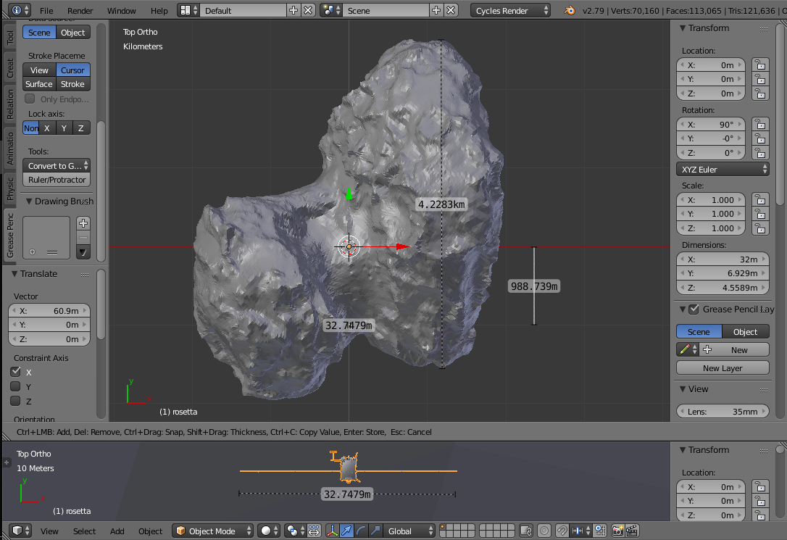
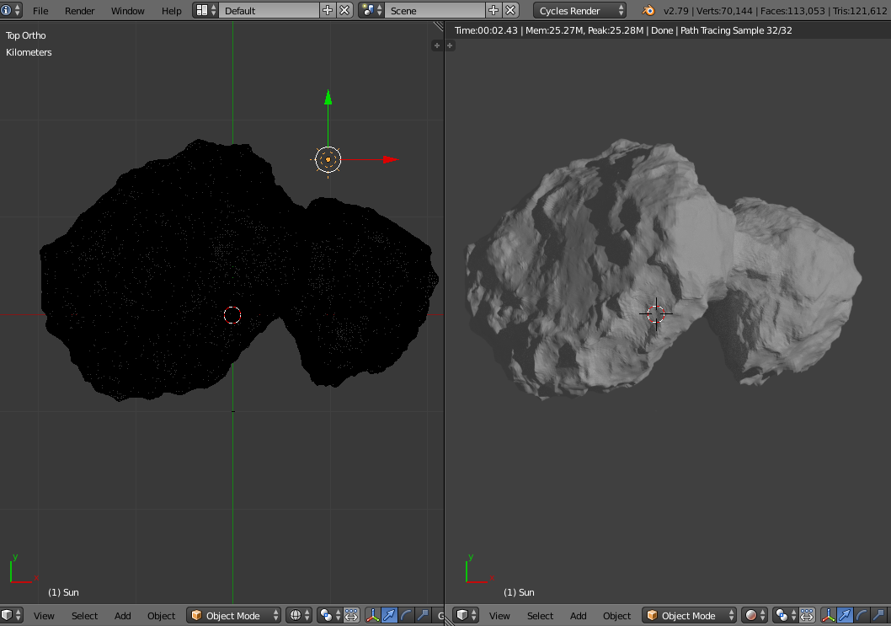

# ARKit-Stereoscope-67P (updating Apr 27, 2019. removed .zip file)

ARKit stereoscope visualizes the relative sizes of ESA Rosetta space probe to 67P/Churyumov-Gerasimenko comet.

This project was inspired by a European Space Agency's webpage explaining the relative sizes of the Rosetta space probe to comet 67P/Churyumov-Gerasimenko:
 
[ESA: How big is Rosetta compared with the comet?](http://sci.esa.int/rosetta/54831-how-big-is-rosetta-compared-with-the-comet/)
 
With ESA and NASA open sourcing their data such as 3D models and images, anyone can use tools such as iPad Swift Playgrounds and ARKit to visualize the comet with a stereoscope.

# Hardware

1. Apple 2018 9.7" iPad (A9 CPU or higher for ARKit, should work on 2017 9.7" iPad). 

   Update: ARKit-Stereoscope-67P playground works on 2019 iPad mini and 2019 iPad Pro (some changes to Contents.swift are needed for the different screen sizes and different refresh rate of iPad Pro). May have to experiment with fitting the OWL Stereoscopic Viewer on different sized iPad.

2. The OWL Stereoscopic Viewer(£15.00) from [The London Stereoscopic Company Ltd](https://www.londonstereo.com/)

   Beside using it to view 3D models with tracking, it can also be used in a browser to view stereoscopic images from [Library of Congress](http://www.loc.gov/pictures/collection/stereo/) or [New York Public Library](https://stereo.nypl.org/).

   For more current images, [London Stereoscopic Company Ltd](https://www.londonstereo.com/3-D-gallery1.html).
   
   

It is advisable to get a protective silicon case for the iPad to minimize the stereoscope sliding on the screen. The stereoscopic viewer is held in place by the user to allow switching between viewing and programming Swift. "Portrait Orientation Lock" is on as this should be the most comfortable position to hold the iPad with the viewer and moving around virtual objects.

# Software

Apple Swift Playgrounds (2.2) from iOS App Store. Swift Playgrounds lets kids program their iPad directly to experiment with ARKit and Scenekit.

[Swift Playgrounds](https://www.apple.com/ca/swift/playgrounds/)

# Installation

In iOS Safari, [download ARKit-Stereoscope-67P.playground.zip](https://github.com/Physicslibrary/ARKit-Stereoscope-67P/blob/master/ARKit-Stereoscope-67P.playground.zip), and "Open in Playgrounds".

ARKit-Stereoscope-67P playground was created from the Blank template in Swift Playgrounds.

This playground doesn't look for a flat plane to put virtual objects on, instead the initial position of the iPad 
is the world origin when "Run My Code" is pressed.
 
Virtual objects are positioned and oriented according to this world origin (with righteye.debugOptions on, the 
world origin is the XYZ or RGB axis)

If frame rate <60Hz, hold iPad still, press iPad HOME button, return to Swift Playgrounds

# Credits
 
ESA_Gaia_DR2_AllSky_Brightness_Colour_Cartesian_2000x1000.png 
Date: 25 April 2018 
Satellite: Gaia 
Copyright: ESA/Gaia/DPAC, CC BY-SA 3.0 IGO 
http://sci.esa.int/gaia/60196-gaia-s-sky-in-colour-equirectangular-projection/ 
 
CSHP_DV_257_01_______00343.obj (OBJ File 3.8MB) 
Copyright: ESA/Rosetta/NAVCAM – CC BY-SA IGO 3.0 
https://imagearchives.esac.esa.int/index.php?/page/navcam_3d_models 
https://imagearchives.esac.esa.int/index.php?/page/copyright_information 

Rosetta.blend (Rosetta.zip 4MB) 
Author/Origin: Eyes on the Solar System. NASA/JPL-Caltech 
https://nasa3d.arc.nasa.gov/detail/eoss-rosetta 
https://www.nasa.gov/multimedia/guidelines/index.html 

# Using Blender to scale Rosetta and Comet 67P

In the [playground Resources folder](https://github.com/Physicslibrary/ARKit-Stereoscope-67P/blob/master/ARKit-Stereoscope-67P.playground/Pages/Rosetta%20vs%2067P.xcplaygroundpage/Resources/), there are 5 files: 

67P.obj 
67P.png 
ESA_Gaia_DR2_AllSky_Brightness_Colour_Cartesian_2000x1000.png 
cube.obj 
rosetta.obj 

Blender 2.79b was used to scale Rosetta.blend to 32m and exported as rosetta.obj.

CSHP_DV_257_01_______00343.obj was Cycles render baked to generate texture 67P.png and exported as 67P.obj. 
 
https://www.blender.org/ 

This section assumes users are familiar with Blender (www.blender.org, youtube, books) and shows some steps used in project.

Open Rosetta.blend from [NASA 3D Resources](https://nasa3d.arc.nasa.gov/detail/eoss-rosetta). Display wireframe, press keyboard "a" , join all meshes.

"Export OBJ" with options "Selection Only", "Apply Modifiers", and "Scale: 1.00".

Restart Blender, import Rosetta.obj and CSHP_DV_257_01_______00343.obj. 

Set Blender to "Cycles Render", and "Units" to Kilometers, "Lengths:" to Metric, and "Unit Scale" to 1000. This will export files that is read properly by Swift Playgrounds. 

In Blender, Rosetta is incorrect with x dimension 32km. For Rosetta, change x = 32m. When x = 32m, "Scale: X" adjusts itself to 0.001. Change scale Y and Z to 0.001. For the comet, the dimensions of imported file CSHP_DV_257_01_______00343.obj are correct. Using 
http://sci.esa.int/rosetta/54829-rosetta-and-comet-67p-to-scale-annotated/ as a reference as to where to measure 4.1km.

Change "View Clip: Start:" to 1m and "View Chip: End:" to 10km to stop clipping. Zoom in until see Rosetta inside comet. 

Select comet, grab the green arrow (left mouse button) and slide it to the right. This will increase the Y position of the comet in the + direction. 

Rosetta will reach the surface when the comet Y = 426m. 

Change the comet's origin to the 3D cursor. 

Change view to "Top" and "Ortho". Zoom out. Select Rosetta and move its Y location to -1km. 

Use "Grease Pencil" and "Ruler/Protractor" to check dimensions. 

Next, create a texture map for the comet. 

Select comet. Split another 3D View. One 3D view in "wireframe" and the other in "Rendered". In the wireframe view, "Add","Lamp", and "Sun". Adjust the rotation (keyboard r) of the sun lamp in the top, front, and right views to change the lighting of the comet in 3D Rendered View (position of sun lamp does not change lighting). 

Change one of the views to "UV/Image Editor", create a new image named 67P.png, "OK". 

With comet selected, go to Edit Mode, "Mesh", "UV Unwrap", "Smart UV Project", "OK". 

Change the view to "Node Editor", "Add a new material", "Add" "Texture" "Image Texture", in "Image Texture" "Browse Image to be linked" to 67P. 

Return the view to "UV/Image Editor", on the right, "Scene" "Bake" and press "Bake", save image as 67P.png after baking. 

With comet selected, "Export OBJ" with options "Selection Only", "Apply Modifiers", "Include Edges", "Write Normals", "Include UVs, "Scale: 1.00". 

With rosetta selected, "Export OBJ" with options "Selection Only", "Apply Modifiers", "Scale: 1.00".  

Copyright (c) 2019 Hartwell Fong

